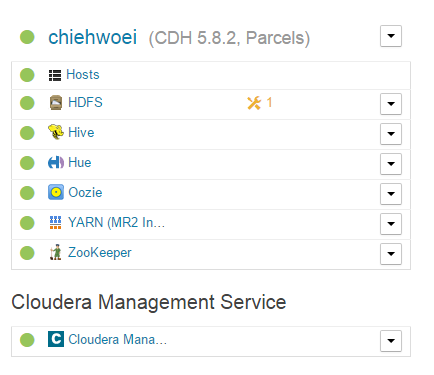

#Cloudera Installation
---
##cloudera manager installation
wget https://archive.cloudera.com/cm5/redhat/7/x86_64/cm/cloudera-manager.repo
add the repo to yum repository

sudo yum install cloudera-manager-agent cloudera-manager-daemons

## configure MySQL Databases
http://www.cloudera.com/documentation/enterprise/5-8-x/topics/cm_ig_mysql.html#cmig_topic_5_5_2

create all database and grant all role

at the cloudera manager node
sudo /usr/share/cmf/schema/scm_prepare_database.sh mysql -h cwcdh1.cwdomain.local -utemp -ptemp --scm-host cwcdh1.cwdomain.local scm scm scm

## start cloudera CDH installation
sudo service cloudera-scm-server start

login to cloudera server manager. 
http://54.254.130.16:7180/

add the following repo to install 5.8.2 parcel
https://archive.cloudera.com/cdh5/parcels/5.8.2/

## issue during CDH installation
1.	Multiple Host using Local IP 127.0.0.1 for the cluster. Cant reach Namenode.
	- resetup Cloudera-scm-agent
	
2. 	Missing oozie and Hue database
	- create db in mysql

3.	Zookeeper start role fail
	- missing Java Home
	- Install openjdk 1.7 and export java_home
	
##Cloudera Cluster

 
	
