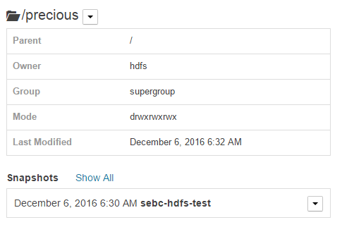
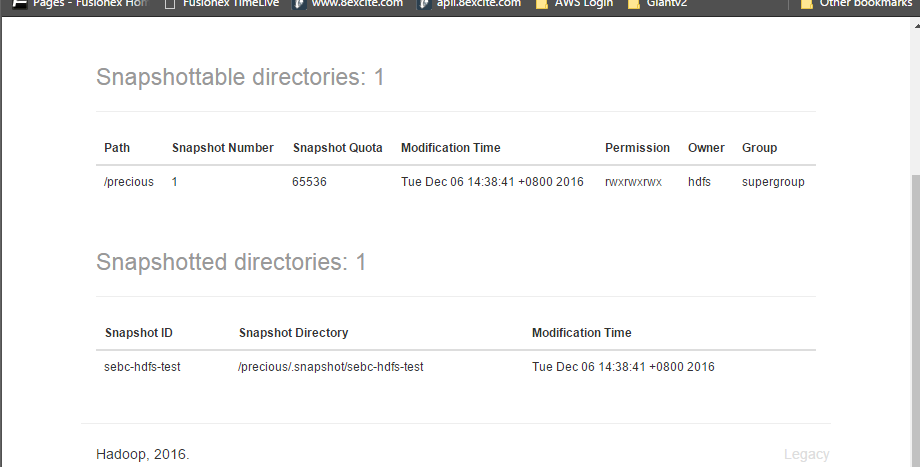

## Create the precious path in hdfs
hdfs dfs -mkdir /precious

## Eanable snapshots for precious through CM
```
 [hdfs@cwcdh2 centos]$ hdfs lsSnapshottableDir
 drwxr-xr-x 0 hdfs supergroup 0 2016-12-06 06:24 1 65536 /precious
```

## create a snapshots 'sebc-hdfs-test' through CM and delete content inside /precious

## restore back the snapshot through CM and verify the file is recovered. 
<center> 
<center> 


